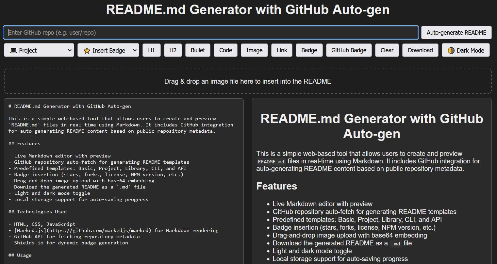

# README.md Generator with GitHub Auto-gen

This is a simple web-based tool that allows users to create and preview `README.md` files in real-time using Markdown. It includes GitHub integration for auto-generating README content based on public repository metadata.

## Features

- Live Markdown editor with preview
- GitHub repository auto-fetch for generating README templates
- Predefined templates: Basic, Project, Library, CLI, and API
- Badge insertion (stars, forks, license, NPM version, etc.)
- Drag-and-drop image upload with base64 embedding
- Download the generated README as a `.md` file
- Light and dark mode toggle
- Local storage support for auto-saving progress

## Technologies Used

- HTML, CSS, JavaScript
- [Marked.js](https://github.com/markedjs/marked) for Markdown rendering
- GitHub API for fetching repository metadata
- Shields.io for dynamic badge generation

## Usage

1. Open the application in a browser.
2. Choose a template or start typing your Markdown manually.
3. Optionally, enter a GitHub repository (`user/repo`) to auto-fill data.
4. Insert badges, format content, and preview live.
5. Download your completed `README.md` file.

## Screenshot

## License

MIT
